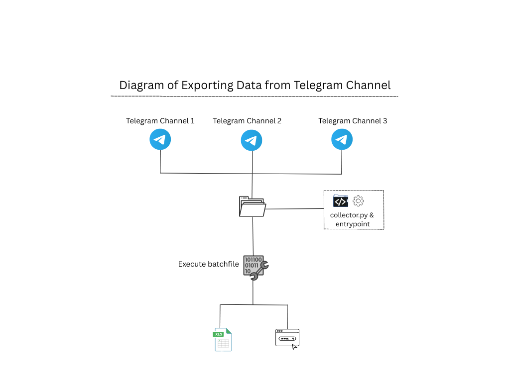

# Automatic_Data_Collection_System

Automatically collection the data from the telegram and export in real time 

Installation 
-------------
Creating Developer Environment  
1.Installation Python  
2.pip install telethon  
3.Execute File 

Configuration for Code 
----------------------
variable api_id & api_hash can change. 

Reference:https://my.telegram.org/apps
